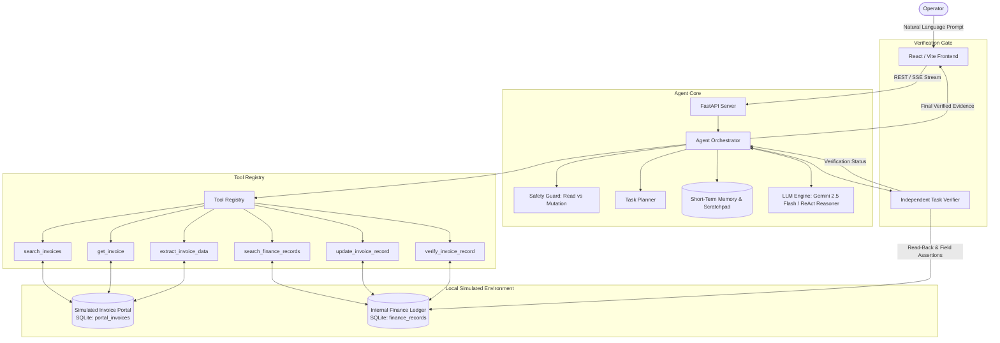

# CentrAlign AI — Autonomous Task Worker

> **Autonomous AI Task Worker for Invoice Processing & Enterprise Finance Synchronization**  
> *Built for the CentrAlign AI — AI Engineering Intern assignment.*

[](https://fastapi.tiangolo.com)
[](https://react.dev)
[](https://python.org)
[](https://pytest.org)
[](LICENSE)

---

## 1. Project Overview

This project is a genuinely working, narrow **Autonomous AI Task Worker** designed to automate cross-system document extraction and database ledger reconciliation.

Given an unstructured natural-language goal such as:
> *"Find the latest invoice from Acme Corp, extract the amount and due date, update the invoice record in the finance system, and tell me when it is done."*

The AI worker autonomously reasons over available tools, plans a multi-step sequence, inspects candidate documents, handles transient failures, updates the local database, and performs an independent read-back verification check before declaring success.

---

## 2. Problem Being Solved

Enterprise finance teams routinely perform tedious reconciliation between external document repositories (PDF portals, vendor portals) and internal enterprise resource planning (ERP) databases. Simple deterministic scripts break when file formats change or when vendor naming varies, while generic conversational chatbots cannot autonomously inspect databases, handle transient network collisions, or guarantee database verification.

This autonomous task worker solves this by combining structured tool execution with LLM reasoning, explicit short-term memory, and verification gates.

---

## 3. Architecture

The system follows a clean modular architecture:

- **Frontend (`frontend/`)**: React + Vite UI showing live Server-Sent Events (SSE) log streams, dynamic plan cards, verification badges, and dual-table database inspectors.
- **Backend API (`backend/app/api/`)**: FastAPI endpoints for agent execution, streaming, simulated portals, and demo scenario triggers.
- **Agent Orchestrator (`backend/app/agent/`)**: Coordinates the ReAct execution lifecycle, safety gating, entity scratchpad memory, and post-execution verification.
- **Tool Registry (`backend/app/tools/`)**: Modular catalog of atomic tools with JSON schemas, duration metrics, and error handling.
- **Simulated Environment (`backend/app/services/` & `models/`)**: Local SQLite databases simulating an external Invoice Document Portal and an Internal Finance Ledger.

---

## 4. Architecture Diagram



---

## 5. Agent Execution Loop

The agent implements a structured **ReAct (Reason + Act)** autonomous execution loop:

1. **Understand Goal**: Parses user instruction and context.
2. **Safety Check**: Asserts whether requested database mutations are authorized by the user prompt.
3. **Plan**: Establishes initial multi-step roadmap.
4. **Cognitive Reasoning**: Queries the LLM provider with observation history, entity scratchpad, and available tool schemas.
5. **Tool Selection & Execution**: Dispatches atomic tool via `ToolRegistry`.
6. **Observation Capture**: Records tool response, structured latency metrics, and error payloads.
7. **Adaptation & Retry**: If a transient failure occurs (e.g., database lock), the agent notes the failure and autonomously retries.
8. **Independent Verification**: Once update succeeds, calls `verify_invoice_record` to assert that stored values match expected values.
9. **Final Evidence**: Formulates a concise summary with verified record details.

---

## 6. Available Tools

| Tool Name | Type | Description |
| :--- | :--- | :--- |
| `search_invoices` | Read | Search invoice portal by company name or keyword. Returns candidate documents sorted by issue date. |
| `get_invoice` | Read | Fetch complete invoice record and raw text content by invoice number (e.g. `INV-1003`). |
| `extract_invoice_data` | Read | Extract structured financial entities (invoice number, company, amount, due date, currency). |
| `search_finance_records` | Read | Search internal finance ledger records for existing entries. |
| `update_invoice_record` | **Mutation** | Persist verified amount, due date, and notes to the finance database. |
| `verify_invoice_record` | Read | Independently read back the record from the database and assert that stored values match expectations. |

---

## 7. How Autonomy Works

The agent does **not** run a hardcoded workflow script. Instead:
- The LLM dynamically receives tool descriptions and observation history.
- When searching for "latest invoice", the agent receives candidate invoices (e.g. `INV-1001`, `INV-1002`, `INV-1003`), compares issue dates, and autonomously selects the most recent one.
- Each subsequent action is chosen based on the observation from the previous step.

---

## 8. How Failure Recovery Works

- If `update_invoice_record` encounters a transient database lock (`FINANCE_DB_LOCK_TIMEOUT`), it returns a structured error object with `retryable: true`.
- The Agent observes the error, updates short-term memory, increments the retry counter, and re-executes the tool.
- A controllable failure trigger (`FAIL_FIRST_UPDATE=true` or UI toggle) allows instant demonstration of this self-healing capability.

---

## 9. How Verification Works

The agent **never** claims success solely because an update tool executed:
1. It executes `verify_invoice_record` which reads the record afresh from the SQLite database.
2. It asserts `stored.amount == expected.amount` and `stored.due_date == expected.due_date`.
3. Only when all assertions pass is the task marked `COMPLETED` and `verification_passed = True`.
4. If a discrepancy exists (tested via `FAIL_VERIFICATION=true`), the agent halts and reports the exact discrepancy to the user.

---

## 10. Safety / Approval Model

- **Read-Only Tools** (`search_invoices`, `get_invoice`, `extract_invoice_data`, `search_finance_records`, `verify_invoice_record`): Permitted unconditionally.
- **Mutation Tools** (`update_invoice_record`): Intercepted by `SafetyGuard`.
  - If the user prompt explicitly requests a write (e.g., *"update the finance system"*), the action proceeds.
  - If the user prompt only requested a read (e.g., *"Find Acme's invoice"*), the mutation is blocked, returning a `BLOCKED_SAFETY` state.

---

## 11. Database Schema

### `portal_invoices` (Simulated Invoice Portal)
- `id`: Integer (PK)
- `invoice_number`: String (Unique, e.g. `INV-1003`)
- `company`: String (e.g. `Acme Corp`)
- `issue_date`: String (`YYYY-MM-DD`)
- `due_date`: String (`YYYY-MM-DD`)
- `amount`: Float
- `currency`: String (`USD`)
- `status`: String (`ISSUED`, `PAID`)
- `raw_content`: Text (Simulated raw invoice document)
- `created_at`: DateTime

### `finance_invoice_records` (Internal Finance Ledger)
- `id`: Integer (PK)
- `invoice_number`: String (Unique)
- `company`: String
- `amount`: Float
- `due_date`: String
- `currency`: String
- `sync_status`: String (`PENDING_ENTRY`, `SYNCED`, `DISCREPANCY`)
- `last_verified_at`: DateTime
- `notes`: Text
- `updated_at`: DateTime

---

## 12. Setup Instructions

### Prerequisites
- Python 3.12+ (tested on Python 3.13)
- Node.js 18+ & npm
- Git

### Installation Steps

1. **Clone the Repository**:
   ```bash
   git clone <repo-url>
   cd "CentrAlign AI"
   ```

2. **Backend Setup**:
   ```bash
   cd backend
   python -m pip install -r requirements.txt
   ```

3. **Frontend Setup**:
   ```bash
   cd ../frontend
   npm install
   ```

---

## 13. Environment Variables

Copy `.env.example` to `backend/.env`:

```bash
cp .env.example backend/.env
```

| Variable | Description | Default |
| :--- | :--- | :--- |
| `GEMINI_API_KEY` | Google Gemini API Key (Optional) | `""` |
| `LLM_PROVIDER` | `auto`, `gemini`, or `mock` | `auto` |
| `LLM_MODEL` | Gemini Model Identifier | `gemini-2.5-flash` |
| `DATABASE_URL` | SQLite database URI | `sqlite:///./centralign_task_worker.db` |
| `FAIL_FIRST_UPDATE`| Global trigger for transient failure demo | `false` |
| `FAIL_VERIFICATION`| Global trigger for verification failure demo | `false` |

> *Note: If `GEMINI_API_KEY` is not provided, the system automatically runs on its built-in high-performance Deterministic ReAct Reasoner, guaranteeing 100% offline functionality.*

---

## 14. How to Run

### Start Backend Server:
```bash
cd backend
python -m uvicorn app.main:app --host 0.0.0.0 --port 8000 --reload
```
*Backend runs at: `http://localhost:8000` (API Docs: `http://localhost:8000/docs`)*

### Start Frontend UI:
```bash
cd frontend
npm run dev
```
*Frontend runs at: `http://localhost:5173`*

---

## 15. Example Tasks

1. **Acme Corp Task**:
   > *"Find the latest invoice from Acme Corp, extract the amount and due date, update the invoice record in the finance system, and tell me when it is done."*
2. **Globex Task**:
   > *"Find the latest invoice from Globex, extract the amount and due date, update the invoice record in the finance system, and tell me when it is done."*
3. **Initech Task**:
   > *"Find the latest invoice from Initech, extract the amount and due date, update the invoice record in the finance system, and tell me when it is done."*
4. **Umbrella Corp Task**:
   > *"Find the latest invoice from Umbrella, extract the amount and due date, update the invoice record in the finance system, and tell me when it is done."*

---

## 16. Test Instructions

Run the comprehensive 35-test pytest suite:

```bash
cd backend
python -m pytest -v
```

### Coverage Highlights:
- Invoice search & date sorting (latest detection)
- Entity extraction from structured text
- Finance ledger lookup & updating
- Failure detection & retry recovery (transient DB lock)
- Verification success & verification rejection
- Multi-company generalization (Acme, Globex, Initech, Umbrella)
- Safety policy guarding against unauthorized mutations
- All FastAPI REST endpoints & demo scenario routes

---

## 17. Known Limitations

- **Simulated Environment**: Operates against local SQLite databases simulating company portals rather than live production SAP/Workday instances.
- **Document Input**: Invoices are represented as structured text documents within the portal rather than raw scanned PDF images requiring multi-modal OCR.
- **Short-Term Memory**: Memory is scoped to the execution lifecycle of a single task; it does not persist cross-task semantic memory across sessions.

---

## 18. Hard-Coded vs Autonomous Configuration

| Component | Nature | Detail |
| :--- | :--- | :--- |
| **Tool Execution Flow** | **Autonomous** | Decided dynamically by LLM reasoner based on previous observations |
| **Document Selection** | **Autonomous** | Chronological reasoning determines the latest invoice |
| **Data Extraction** | **Autonomous** | Entity parsing extracts amounts, dates, and vendor metadata |
| **Failure Recovery** | **Autonomous** | Assesses retryability of errors and adapts next tool call |
| **Seed Documents** | Config | Initial sample invoices seeded for Acme, Globex, Initech, Umbrella |
| **Safety Policies** | Config | Rule set defining mutations that require explicit user write intent |

---

## 19. AI Models Used

- **Google Gemini 2.5 Flash**: Default model when `GEMINI_API_KEY` is provided.
- **Deterministic ReAct Reasoner**: Zero-dependency offline cognitive engine implementing full ReAct loop for predictable testing and offline evaluations.

---

## 20. AI Coding Tools Disclosure

In accordance with assignment guidelines:
- **AI Coding Tools Used During Development**: Google Antigravity / Gemini 3.7 Flash.
- **External Libraries**: FastAPI, Pydantic, SQLAlchemy, Uvicorn, Pytest, React, Vite.

---

## 21. Future Improvements

1. Add Playwright browser navigation tools for interacting with live web document portals.
2. Integrate visual OCR (Gemini Vision) for extracting unformatted scanned PDF invoices.
3. Implement Human-in-the-Loop (HITL) confirmation modals directly within the UI when safety guard flags ambiguous requests.
4. Support multi-currency FX conversions against a live currency rate API.

---

## 22. Demo Instructions

Follow the complete 3–5 minute presentation script in [docs/demo_script.md](file:///c:/Users/kedia/OneDrive/Desktop/CentrAlign%20AI/docs/demo_script.md) for live technical interview walkthroughs.
