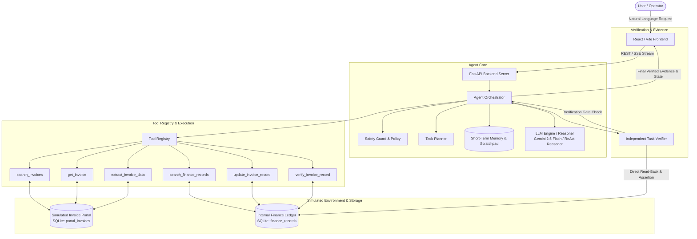

# CentrAlign AI — Autonomous Task Worker Architecture

This document details the system design, component boundaries, execution lifecycle, and verification mechanics of the Autonomous Task Worker for Invoice Processing and Finance Ledger Synchronization.

---

## 1. System Architecture Overview



---

## 2. Core Components & Responsibilities

### A. Frontend Layer (`frontend/src/`)
- **React + Vite Application**: Modern, high-performance web interface.
- **Components**:
  - `TaskInput`: Accepts arbitrary natural-language instructions with vendor shortcuts and controlled failure injection toggles.
  - `DemoControls`: 1-click execution for standard success, self-healing retry, verification failure, and multi-vendor generalization.
  - `PlanSteps`: Dynamically renders the 6-stage execution plan and tracks live progress.
  - `LiveLogs`: Collapsible timeline showing cognitive thought steps, tool inputs, latency (ms), observations, and retries.
  - `VerificationBadge`: Dedicated gate status showing exact verified fields vs. discrepancies.
  - `PortalsOverview`: Live dual-tab viewer into the simulated invoice portal documents and the internal finance database table.

### B. Agent API Layer (`backend/app/api/`)
- `agent_routes.py`:
  - `POST /api/agent/run`: Synchronous execution returning full state.
  - `GET /api/agent/stream`: Server-Sent Events (SSE) streaming live steps to the UI in real time.
  - `GET /api/agent/tools`: Exposes tool schemas and parameter contracts.
- `portal_routes.py`: Endpoints for querying portal documents, finance records, and resetting databases.
- `demo_routes.py`: One-click scenario endpoints for automated interview demonstrations.

### C. Agent Orchestration Engine (`backend/app/agent/`)
- **`orchestrator.py` (`AgentOrchestrator`)**:
  - Central control loop coordinating memory, safety checks, LLM tool selection, tool dispatch, error adaptation, and verification gating.
- **`safety.py` (`SafetyGuard`)**:
  - Distinguishes read-only actions from mutations.
  - Ensures database write tools (`update_invoice_record`) are only executed when authorized by the user prompt.
- **`planner.py` (`TaskPlanner`)**:
  - Breaks the natural-language goal into a structured multi-phase execution roadmap.
- **`memory.py` (`AgentMemory`)**:
  - Explicit, inspectable short-term context tracking previous observations, entity scratchpad (invoice number, amount, due date), and retry counters.
- **`verifier.py` (`TaskVerifier`)**:
  - Executes independent read-back from the database to ensure stored values strictly match extracted values before completion is acknowledged.
- **`llm_provider.py` (`BaseLLMProvider`)**:
  - Pluggable provider supporting Gemini 2.5 Flash via `google-genai` SDK and a built-in Deterministic ReAct Reasoner for offline testability.

### D. Tool System (`backend/app/tools/`)
- **`registry.py` (`ToolRegistry`)**: Central catalog that validates schemas, measures latency, captures exceptions, and executes tools.
- **Tools**:
  1. `search_invoices`: Queries invoice documents by company or keyword.
  2. `get_invoice`: Fetches full invoice document and line items.
  3. `extract_invoice_data`: Extracts structured invoice entities (amount, due date, invoice ID).
  4. `search_finance_records`: Searches internal finance system records.
  5. `update_invoice_record`: Updates amount and due date in the finance database (with transient error simulation support).
  6. `verify_invoice_record`: Independently reads back the stored record and asserts field matching.

---

## 3. The ReAct Execution Loop

```
1. Receive Goal
   ↓
2. Safety Policy Evaluation (Authorize Read vs Mutation)
   ↓
3. Initialize Plan & Short-Term Memory
   ↓
4. Cognitive Loop (LLM / Reasoner)
   ├── Input: User goal + Observation History + Tool Schemas + Entity Scratchpad
   └── Output: Thought + Action + Tool Choice + Input Arguments
   ↓
5. Dispatch Tool via ToolRegistry
   ↓
6. Tool Execution against Simulated Environment
   ↓
7. Capture Observation & Measure Latency
   ↓
8. Failure & Retry Evaluation
   ├── If transient failure (e.g. DB 503 Lock): Increment retry count, adapt parameters, retry
   └── If unrecoverable: Halt and report structured diagnostics
   ↓
9. Independent Verification Gate
   ├── Read-back record from finance database
   └── Assert expected amount == stored amount AND expected due_date == stored due_date
   ↓
10. Formulate Final Response with Concrete Evidence Summary
```

---

## 4. Key Architectural Decisions

1. **No Monolithic `process_invoice()` Function**:
   Every action is an atomic tool. The agent autonomously selects the tools, handles candidate comparisons, and chains operations dynamically.
2. **True Verification Gating**:
   The agent does NOT assume that calling `update_invoice_record` implies database correctness. It issues an independent query to assert persisted values.
3. **Pluggable & Offline Testable**:
   Supports live Gemini API keys while providing a Deterministic ReAct Reasoner that allows 100% offline unit testing, zero flake rates, and fast interview demos.
4. **Safety Policy by Design**:
   Un-prompted mutations are blocked at the policy layer, protecting internal databases from unintended side-effects.
